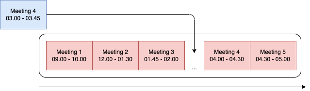
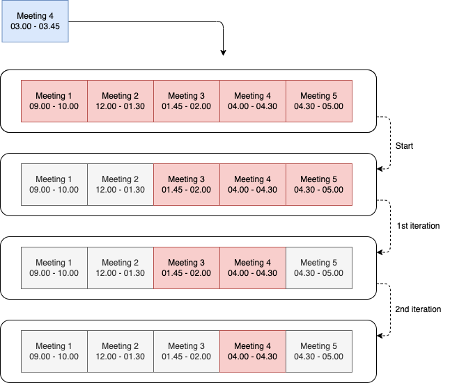
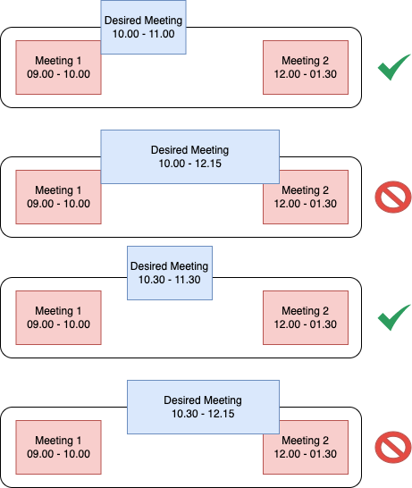

# Caribou’s Take Home Test - Calendar

This is the Take-Home-Test solution for Caribou, asking to implement a calendar functionality available to serve the following use cases:
1. Backend:
   - implement API listing upcoming/all meetings
   - implement API obtaining date in format of a string of ISO standard, i.e. `2023-01-28T11:00:00.000Z` and return next 10 one hour slots, available to book with default one hour meeting
   - implement API obtaining an object in form of JSON, i.e.`{"eventName": "Book", "desiredStartTime": "2023-01-28T14:00:00.000Z", "duration": 105}`, and book the desired time slot. If it is not possible to book it - return an appropriate response

This solution doesn’t touch fronted, since it would be too much for 3 hours test, since the backend should be written from scratch, including all boiler-plating, integration, etc.

## Storing Time Slopes
There are few things we need to consider before jumping into implementation details. One of them is how we’re going to store data and represent it internally as a data structure. Since this application is nothing more than a simple application written within few hours, it doesn’t have a database, thus we need to think only data representation at the application level.

The most naive and obvious way to define the data structure for our purposes is to use indexed array where every cell would be equal to 1 hour. It may be represented like this:



As a great benefit we will get the ease of the algorithm to search for slot availability. Literally, to find some free slot here we need to iteratively loop over the array from the desired point and find the first available one.

However there are few drawbacks. The first one is memory consumption. Even if we through away all others, imagine how we will track a month, or a quarter - in case of month we need to have an array with at least 640 cells and for the quarter that number will be tripled.

Then what happens if we would like to make our meetings a bit more precise? At the moment we leverage one hour slot and assume all the meetings will stay within that slope, which is good, but not always true. Increasing the sampling of the time slope up to 15 minutes instead of 1 hour brings us another 2,560 cells in total for month and about 10k for the quarter. Moving next up to one minute and we get 38,400 items for month.

Another issue is raising up from the moment that meeting might be more than one interval whatever that interval can be. With this structure we need to create a way to join those intervals and keep them groupped.

Another way of store calendar data is to use the same indexed array but without sampling, like in the picture below:



This way of storing data is much efficient from memory consumption point of view, as well as a way flexible in terms of setting different meetings with different duration. It is important that array will stay sorted, which means every modification on it should also trigger sorting operation as well. However, using such a structure requires a bit more complex algorithms to use, which may be not as obvious as in the case above.

## Algorithms
Discussing algorithms we need to touch use cases, because for every of them we might want to use a different algorithm.

### Use Case - Getting all time slopes from calendar to review
This use case is pretty simple. Getting an array of meetings stored, we need to iterate over it and retrieve every meeting to return it back.
Complexity is O(N), memory consumption - constant.

### Use Case - Check whether specific time slop available or not
Here is the core use case; it is used in searching and booking operations as a basic with some extensions on top of it.

Naive implementation includes full pass through the array of meetings while iteratively looking for necessary parameters to determine where desired meeting should be placed:



That would give us linear complexity on searching every time we need to find available time slope.
However our array of meetings is already sorted, which means we can minimize that up to logarithmic complexity by leveraging a simple binary search:

```typescript
while (left < right) {
  let index = Math.floor((left + right) / 2);
  let bookedMeeting: Meeting = calendar[index];

  if (comparator(bookedMeeting, meeting) == 0) {
    return index;
  } else if (comparator(bookedMeeting, meeting) < 0) {
    left = index + 1;
  } else {
    right = index - 1;
  }
}
return left;
```

using this code will return us the index of the next element, following after the meeting ended before or exact at the time we start searching from, using the following `comparator` as a function:

```typescript
(m0: Meeting, m1: Meeting) =>
  m0.start.getTime() == m1.start.getTime() && m0.end.getTime() == m1.start.getTime() ?
    0 : m0.start.getTime() > m1.start.getTime() && m0.end.getTime() > m1.end.getTime() ?
      1 : -1
)
```

As a result we will get a number containing an index of the meeting from the Calendar array which need to be checked for any possible conflicts. If there are no conflicts - return `true` meaning it is possible to book it, otherwise - `false`, which means that time slope has intersections with the desired time.

This is representation how it would look like from algorithmic prospective:



Returning value from the algorithm will be `3` (highlighted in red), showing that this meeting should be compared with the already booked meeting sitting in the Calendar array under the index `3` and depending on that comparison provide a response.

### Use Case - Check whether specific time slot is available. Find another 10 closest available slots
This is the case where we actually need to consider a bit more complex logic, since we not only need to decide whether observing time slot is available for meeting to book, but find another 10 closest available slots following right after the desired/available one just in case to show our care for customers.

This algorithm actually needs to combine the previous one together with the linear search because of the following:
1. using binary search cut off all meetings happened or planned before desired one and return the index of the current/next meeting (previous use case)
2. having index of the current/next meeting, check whether it is possible to use the time slot and book a meeting or not to return the appropriate response
3. if it is available to book desired meeting using the index returned from the binary search - then add it to the list of available slots to return to the customer and start looking for another one, if it is not - then increase index and shift desired window to the end of the current desired window
4. iterate previous step until all 10 slots will be found

Step 3 requires a bit more words to understand how it will work. When we get the index from the binary search it is possible we will have one of the following situations:



It is necessary to mention that all the last three situations are possible to happen only once - when binary search finished working and returned the index of the current/next meeting stored in the Calendar array. Later on, while we start shifting the pointer of the desired window, we’ll take care that there will be no gaps between the end of one meeting and beginning of the another one since the goal is to find 10 **closest available** time slots.

That being said we have to perform few steps to determine whether we can guarantee that the searching time slot is available. Here is how:
- check the duration of the Desired Meeting and compare it with the interval between Meeting 1 with `index-1` (if exists) and Meeting 2 with index of `index`
- if duration of the Desired Meeting is greater than the time slope between booked Meeting 1 and Meeting 2, then we need to start looking for another interval, thus we should increase `index` by adding `1`  and shift start of Desired Meeting window to the end of the Meeting 2
- if the duration is enough then we need to check whether Desired Meeting start is equal to the end of the Meeting 1
   - if yes then we’re safe to mark this slope as available for booking, and shift start of Desired Meeting window to the end of the Desired Meeting
   - if no then we have to check whether the end of the Desired Meeting is less than the start of the Meeting 2 to exclude possible interference. Mark this slope as available for booking if there is no interference and shift start of Desired Meeting window to the end of the Desired Meeting or increase `index` by adding `1` if Desired Meeting end falls into the Meeting 2 and shift start of Desired Meeting window to the end of the Meeting 2
- repeat the steps above until we reach the last meeting in the Calendar array
- after reaching the last meeting, all the rest we have to do is to shift start of Desired Meeting window to the end of the Desired Meeting on every iteration and add them into the list to return to the user

#### Algorithmic Complexity of the algorithm
It is easy to notice we combined binary search to find the starting point and move along with the linear search to find available time slots, which gives us some improvement over full linear search.

We still can continue and optimize even that solution, acquiring as a data structure a hashed map, whereas a key `K` we can use a hash (or another representation) of the start time and duration for booked meeting, and then we can get a mix of the data storage where all meetings follow one after each other, like on the picture #2, however we will be also able to access the desired time slope by index - in our case that will be the key `K` part of the map and easily identify whether the time slope is taken or not without iterating and with a complexity of O(1).

#### Space Complexity of the algorithm
It is constant, since we don’t create any additional structures over runtime.

### Use Case - Book a meeting if the time slot is available or return a error
To book a meeting it means we need to get date and duration for desired meeting, then find whether it is possible to book it and in case of the positive answer permanently add to the Calendar array which later will be flashed to the Database.

To perform all of these actions, we have to combine our previously reviewed algorithms and build a chain or flow in the following way. There is a think which worth to mention related to the process of adding a meeting into the Calendar array itself.

The simplest way is to use `push()`  which adds the element to the end of the Calendar array and then sort that Calendar array to be able to continue using binary search. However, that’s not a very efficient way, since it brings a complexity of O(N*logN) in average, because of sorting.

It is better to perform shifting data from the point of insert to the end of the array increased to the one element, like making `lastIndex = lastIndex - 1`, which takes only O(N) complexity and makes it better than  O(N*logN) in case of sorting. However, sorting is easer to use - just call it :)

## Stack
- Node JS v. 16.*
- Typescript v. 4.9.4
- Express v. 4.17.*

## Missing 
Many things are left out of the scope intentionally, like resolving concurrent booking, or joining meeting calendars and searching in slopes for few people.

## Usage
Start the service and there is Postman collection attached you may use to check functionality.
